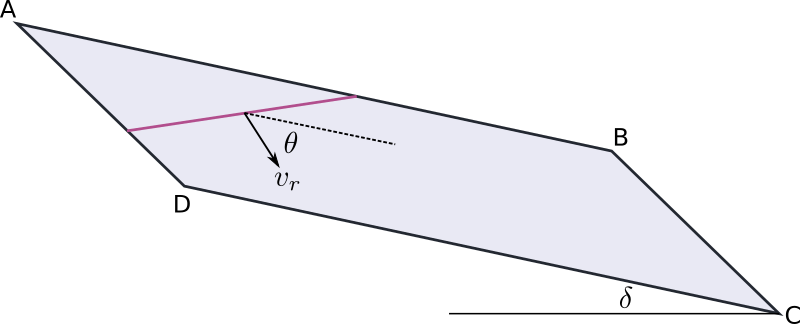

# GRMOT - strong GRound MOTion simulations

Warning : the documentation of the library is still under preparation.

## General description
grmot generates simulated seismographs (displacement, velocity, acceleration) using the 3D discrete wavenumber
representation method.
The core of the library has been written in the Rust programming language but provides a convenient python user interface.

## Installation
The library supports the GNU/Linux operating system

### python 3.6
pip install https://github.com/kesmarag/grmot/blob/main/target/wheels/grmot-0.9.0-cp36-cp36-manylinux_2_5_x86_64.manylinux1_x86_64.whl

### python 3.7
pip install https://github.com/kesmarag/grmot/blob/main/target/wheels/grmot-0.9.0-cp37-cp37-manylinux_2_5_x86_64.manylinux1_x86_64.whl

### python 3.8
pip install https://github.com/kesmarag/grmot/blob/main/target/wheels/grmot-0.9.0-cp38-cp38-manylinux_2_5_x86_64.manylinux1_x86_64.whl

### python 3.9
pip install https://github.com/kesmarag/grmot/blob/main/target/wheels/grmot-0.9.0-cp39-cp39-manylinux_2_5_x86_64.manylinux1_x86_64.whl

### python 3.10
pip install https://github.com/kesmarag/grmot/blob/main/target/wheels/grmot-0.9.0-cp310-cp310-manylinux_2_5_x86_64.manylinux1_x86_64.whl

## Definition of the reference fault

First, we create a reference fault. The following parameters determine the fault.

-   The top center point of the fault (north (km), east (km), depth (km)).
-   The dip and strike angles.

## Definition of subfaults and description of the rupture

We create a number of subfaults.

-   Center of the subfault relative to the reference fault top center (km).
-   Length and width of the subfault (km).
-   Rupture velocity and the orientation of the rupture front.
-   Nucleation time (seconds).
-   Rupture time function

## Using grmot

## License

## References

