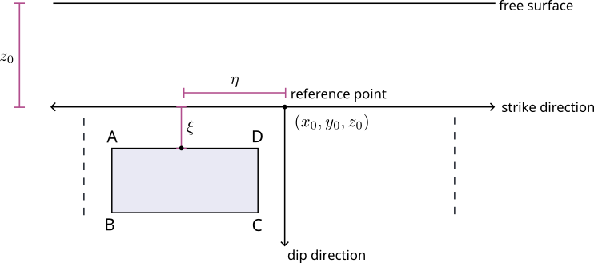

# GRMOT - strong GRound MOTion simulations

Warning : the documentation of the library is still under preparation.

When using this code, please cite the following arxiv manuscript
- manuscript link is to be added

## General description
GRMOT generates simulated seismograms (displacement, velocity, acceleration) using the 3D discrete wavenumber
representation method. The code runs in parallel.
The library's core has been written in the Rust programming language and provides a convenient python user interface.

## Installation
The library supports the GNU/Linux operating system.

### python 3.6
pip install https://github.com/kesmarag/grmot/blob/main/target/wheels/grmot-0.9.0-cp36-cp36-manylinux_2_5_x86_64.manylinux1_x86_64.whl

### python 3.7
pip install https://github.com/kesmarag/grmot/blob/main/target/wheels/grmot-0.9.0-cp37-cp37-manylinux_2_5_x86_64.manylinux1_x86_64.whl

### python 3.8
pip install https://github.com/kesmarag/grmot/blob/main/target/wheels/grmot-0.9.0-cp38-cp38-manylinux_2_5_x86_64.manylinux1_x86_64.whl

### python 3.9
pip install https://github.com/kesmarag/grmot/blob/main/target/wheels/grmot-0.9.0-cp39-cp39-manylinux_2_5_x86_64.manylinux1_x86_64.whl

### python 3.10
pip install https://github.com/kesmarag/grmot/blob/main/target/wheels/grmot-0.9.0-cp310-cp310-manylinux_2_5_x86_64.manylinux1_x86_64.whl

## Using GRMOT
First, we have to create a reference sub-plane. The following parameters determine this sub-plane
- The top center point of the fault (north (\(x_0\) in km), east (\(y_0\) in km), depth (\(z_0\) in km)) with respect to a general reference point.
- The dip and strike angles.

We then create a number of subfaults (see the rectangle ABCD) providing the following.

-   Center of the subfault relative to the reference fault point (in km).
-   Length and width of the subfault (km).
-   Rupture velocity and the orientation of the rupture front.
-   A piece-wise linear rupture time function.

## License
GRMOT is distributed as free software (GPL-v3) it the hope that it will useful, but without any warranty.

## References

