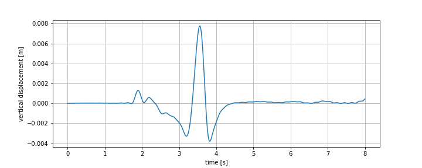

# GRMOT - strong GRound MOTion simulations


Warning : the documentation of the library is still under preparation.

## General description
GRMOT generates simulated seismograms (displacement, velocity, acceleration)
using the 3D discrete wavenumber representation method. The code runs in parallel. 
The library's core is written in the Rust programming language and provides a convenient Python user interface.

## Installation
The library supports the GNU/Linux operating system.

### python 3.6
pip install https://github.com/kesmarag/grmot/raw/main/target/wheels/grmot-0.9.0-cp36-cp36m-manylinux_2_5_x86_64.manylinux1_x86_64.whl

### python 3.7
pip install https://github.com/kesmarag/grmot/raw/main/target/wheels/grmot-0.9.0-cp37-cp37m-manylinux_2_5_x86_64.manylinux1_x86_64.whl

### python 3.8
pip install https://github.com/kesmarag/grmot/raw/main/target/wheels/grmot-0.9.0-cp38-cp38-manylinux_2_5_x86_64.manylinux1_x86_64.whl

### python 3.9
pip install https://github.com/kesmarag/grmot/raw/main/target/wheels/grmot-0.9.0-cp39-cp39-manylinux_2_5_x86_64.manylinux1_x86_64.whl

### python 3.10
pip install https://github.com/kesmarag/grmot/raw/main/target/wheels/grmot-0.9.0-cp310-cp310-manylinux_2_5_x86_64.manylinux1_x86_64.whl

## Using GRMOT
First, we create a reference sub-plane. The following parameters determine this sub-plane

- The top centre point of the fault (north ((x_0) in km), east ((y_0) in km), and depth ((z_0) in km)) with respect to a general reference point.
- The dip, strike and rake angles.


We then create a number of subfaults (see the rectangle ABCD) providing the following.

-   Center of the subfault relative to the reference fault point (in km).
-   Length and width of the subfault (km).
-   Rupture velocity and the orientation of the rupture front.
-   A piecewise linear rupture time function.


The library provides three environmental setups as it is shown in the following image. In parenteses given the density, velocities of p- and s-waves and thickness for each medium.


I. A halfspace

Create a python tupple as follows:
```python
medium = ((rho_1, alpha_1, beta_1, 0),) # with 0 we mean halfspace (infinite thinkness)
```


II. A layer over a halfspace

```python
medium = ((rho_1, alpha_1, beta_1, h_1),
          (rho_2, alpha_2, beta_2, 0),) 
```

III. Two layers over a halfspace


```python
medium = ((rho_1, alpha_1, beta_1, h_1),
          (rho_2, alpha_2, beta_2, h_2),
          (rho_3, alpha_3, beta_3, 0),) 
```

Following a simple test case

```python
from grmot import Fault
import numpy as np
import matplotlib.pyplot as plt

medium = ((2., 2.85, 1.6, 0.03),(2.8, 5.7, 3.2, 0.0),) 
loc = (0.0,0.0,1.0) # (x_fault,y_fault,z_fault)
angles = (55*np.pi/180., 195*np.pi/180., -90.*np.pi/180.) # (dip,strike,rake)
fpars = (1/8, 5.0) # (df [Hz], f_max [Hz])
conf = (400, 400, 80, 80, 1.0) # (nx_max, ny_max, Lx, Ly)
fault = Fault(angles,loc,fpars,medium,conf)

# list of subfaults
subfaults = [((1.0, 1.0, 0.0, 0.0, 2.0, 0.0), # (length across the strike, length across the dip, ξ, η, v_r, θ)
          [(0.0, 0.0), (0.1, 1.0)])] # list that controls the rupture (time, slip (in m))

# list of receivers
receivers = [(0.0,10.0)] # (east,west) in km

n = 2048 # number of samples
dn,de,dv,vn,ve,vv,an,ae,av = fault.simulate(subfaults, receivers, n) # the first letter (d,v,a) stands for displacement, velocity, acceleration, the second letter stands for north, east, vertical

plt.figure(figsize=(10,4))
t = np.linspace(0,8,2048)
plt.grid()
plt.plot(t,dv[0])
plt.ylabel('vertical displacement [m]')
plt.xlabel('time [s]')
plt.show()
```



Here we are presenting the approx_elliptical_crack function.

# **Function: `approx_elliptical_crack`**

## **Purpose**
This function approximates an elliptical crack rupture by discretizing it into rectangular sub-faults. It simulates the rupture process by tracking the evolution of the rupture front, considering a realistic kinematic model and directivity effects.

## **Parameters**
The function accepts a single argument, `crack_params`, which is a tuple containing the following elements:

1. **L** (*float*) – Length of the fault.
2. **W** (*float*) – Width of the fault.
3. **dl** (*float*) – Grid spacing (discretization step).
4. **D1** (*float*) – Semi-major axis of the elliptical rupture front.
5. **D2** (*float*) – Semi-minor axis of the elliptical rupture front.
6. **xi** (*float*) – x-coordinate of the nucleation point.
7. **et** (*float*) – y-coordinate of the nucleation point.
8. **K** (*float*) – Scaling coefficient for slip computation.
9. **dtm** (*float*) – Delay time for rupture initiation.
10. **nx** (*int*) – x-component of the rupture propagation direction.
11. **ny** (*int*) – y-component of the rupture propagation direction.
12. **vrt** (*float*) – Rupture velocity parameter.
13. **code** (*string*) – Identifier for different rupture scenarios.

## **Methodology**
- The function constructs a 2D grid over the fault plane.
- It computes the rupture velocity (`vr`) at each point, taking into account the elliptical shape and directivity effects.
- The rupture front moves with velocity components (`vx`, `vy`) proportional to the aspect ratio of the ellipse.
- Each sub-fault's rupture time is determined by solving kinematic equations.
- The function calculates the slip distribution, rupture velocity field, and rupture front orientation (`theta0`).
- It identifies inconsistencies in `theta0` values and corrects them.
- The seismic moment of each sub-fault is computed and accumulated.

## **Returns**
The function returns a tuple with the following elements:

1. **source_i** (*list of tuples*) – Each tuple contains:
   - `(dl, dl, x, y, dist_nucl, theta0)`: Sub-fault properties.
   - `[(time, slip)]`: Slip evolution at different times.
2. **m0it** (*float*) – Total seismic moment.
3. **maxslip** (*2D array*) – Maximum slip at each sub-fault.
4. **ruptvel** (*2D array*) – Rupture velocity field.
5. **theta0** (*2D array*) – Orientation angles of the rupture front.
6. **code** (*string*) – Input identifier for rupture scenario.

## **Usage Example**
```python
params = (10.0, 5.0, 0.1, 3.0, 2.0, 0.0, 0.0, 1.0, 0.05, 1, 1, 2.5, 'My_Crack')
source, seismic_moment, max_slip, rupture_velocity, angles, scenario_code = approx_elliptical_crack(params)


The library contains several undocumented help functions. Please look at the source code that includes these functions. 

https://github.com/kesmarag/grmot/blob/main/grmot/utils.py


## License
GRMOT is distributed as free software (GPL-v3) in the hope that it will useful, but without any warranty.

## Acknowledgements
I would like to acknowledge Professor Apostolos Papageorgiou for his guidance and valuable advice. 


