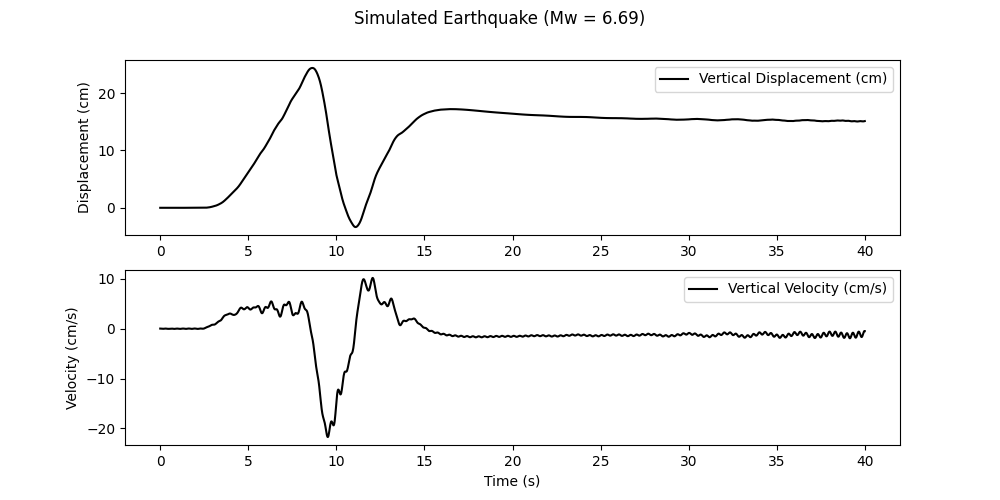

# GRMOT - strong GRound MOTion simulations


Warning : the documentation of the library is still under preparation.

## General description

GRMOT generates simulated seismograms, including displacement, velocity, and accelerations, using the 3D discrete wavenumber representation method.
The code is designed for parallel execution, ensuring efficiency in large-scale simulations.
The library’s core is implemented in Rust for high performance,
while a Python interface provides a user-friendly experience for researchers and engineers.

## Installation

The GrMot library supports GNU/Linux and requires Python 3.6 or later. To install the appropriate version for your Python environment, run:

```bash
pip install $(python -c "import sys; version=f'{sys.version_info.major}{sys.version_info.minor}'; print(f'https://github.com/kesmarag/grmot/raw/main/target/wheels/grmot-0.9.0-cp{version}-cp{version}-manylinux_2_5_x86_64.manylinux1_x86_64.whl')")
```

## Using GRMOT
First, we create a reference sub-plane. The following parameters determine this sub-plane

- The top centre point of the fault (north ((x_0) in km), east ((y_0) in km), and depth ((z_0) in km)) with respect to a general reference point.
- The dip, strike and rake angles.


Next, we divide the fault into multiple subfaults (see rectangle ABCD) and define their properties as follows:

- Center coordinates relative to the reference fault point (in km).
- Dimensions: Length and width of each subfault (km).
- Rupture characteristics: Rupture velocity and orientation of the rupture front.
- Rupture timing: A piecewise linear function defining the rupture onset at each subfault.


The library provides three environmental setups as it is shown in the following image. In parenteses given the density, velocities of p- and s-waves and thickness for each medium.


These parameters are crucial for simulating seismic wave propagation through different layers of the Earth's crust.

I. A halfspace

Create a python tupple as follows:
```python
medium = ((rho_1, alpha_1, beta_1, 0),) # with 0 we mean halfspace (infinite thinkness)
```


II. A layer over a halfspace

```python
medium = ((rho_1, alpha_1, beta_1, h_1),
          (rho_2, alpha_2, beta_2, 0),) 
```

III. Two layers over a halfspace


```python
medium = ((rho_1, alpha_1, beta_1, h_1),
          (rho_2, alpha_2, beta_2, h_2),
          (rho_3, alpha_3, beta_3, 0),) 
```

Following a simple test case

```python
from grmot import Fault
import numpy as np
import matplotlib.pyplot as plt

medium = ((2., 2.85, 1.6, 0.03),(2.8, 5.7, 3.2, 0.0),) 
loc = (0.0,0.0,1.0) # (x_fault,y_fault,z_fault)
angles = (55*np.pi/180., 195*np.pi/180., -90.*np.pi/180.) # (dip,strike,rake)
fpars = (1/8, 5.0) # (df [Hz], f_max [Hz])
conf = (400, 400, 80, 80, 1.0) # (nx_max, ny_max, Lx, Ly)
fault = Fault(angles,loc,fpars,medium,conf)

# list of subfaults
subfaults = [((1.0, 1.0, 0.0, 0.0, 2.0, 0.0), # (length across the strike, length across the dip, ξ, η, v_r, θ)
          [(0.0, 0.0), (0.1, 1.0)])] # list that controls the rupture (time, slip (in m))

# list of receivers
receivers = [(0.0,10.0)] # (east,west) in km

n = 2048 # number of samples
dn,de,dv,vn,ve,vv,an,ae,av = fault.simulate(subfaults, receivers, n) # the first letter (d,v,a) stands for displacement, velocity, acceleration, the second letter stands for north, east, vertical

plt.figure(figsize=(10,4))
t = np.linspace(0,8,2048)
plt.grid()
plt.plot(t,dv[0])
plt.ylabel('vertical displacement [m]')
plt.xlabel('time [s]')
plt.show()
```


## Approximation of an Elliptical Crack

This function `approx_elliptical_crack` approximates an elliptical rupture on a fault by considering a set of rectangular sub-faults. The rupture nucleates at an internal point of an elliptical crack and propagates in a self-similar manner. The instantaneous elliptical rupture front moves toward the crack barrier at a constant velocity.

This elliptical kinematic rupture model was first introduced by Burridge and Willis. Here, we approximate the rupture using rectangular sub-faults.


## Function Signature
```python
# L, W, dl, radius_xi, radius_eta, xi, eta, coef, delay, nxi, neta, vr, code  
approx_elliptical_crack(crack_params)
```


## Parameters
- `L` (float): Length of the fault.
- `W` (float): Width of the fault.
- `dl` (float): Grid spacing for discretization.
- `radius_xi` (float): ξ-axis radius of the elliptical crack.
- `radius_eta` (float): η-axis radius of the elliptical crack.
- `xi` (float): ξ-coordinate of the center of the elliptical crack.
- `eta` (float): η-coordinate of the center of the elliptical crack.
- `coef` (float): Scaling factor.
- `delay` (float): Initial time delay of rupture.
- `nxi` (float): ξ-direction of the nucleation point.
- `neta` (float): η-direction of the nucleation point.
- `vr` (float): Rupture velocity (km/s).
- `code` (str): Unique identifier for the fault model.

## Returns
- `source_i` (list): List of rupture details.
- `m0it` (float): Total moment release.
- `maxslip` (numpy array): Maximum slip distribution.
- `ruptvel` (numpy array): Rupture velocity distribution.
- `theta0` (numpy array): Initial rupture angle distribution.
- `code` (str): Fault model identifier.

The following image illustrates the key parameters of the approx_elliptical_crack function.


The nucleation point is denoted by the white dot.

## Test Case: Synthetic Earthquake Simulation Near Samos Island, Greece
We aim to simulate a hypothetical earthquake on the same fault that ruptured during the 2020 Samos earthquake, evaluating its potential impact on Karlovasi main square.

Below is the map of the synthetic rupture, accompanied by the Python code that implements the simulation.


```python
from grmot import approx_elliptical_crack, Fault, latlon_to_km
import numpy as np
import matplotlib.pyplot as plt

it = [24.0, 60.0, 0.5, 4, 12,  8,  -7,  0.6,  0, -1,  2, 2.0, 'Crack']

source, m0, m, r, t, code = approx_elliptical_crack(it)

lat_fault, lon_fault, z_fault = 37.822, 26.740, 1.0
x_fault, y_fault = latlon_to_km(lat_fault, lon_fault)

loc = (x_fault, y_fault, z_fault)

angles = (50*np.pi/180., 276*np.pi/180., -90.*np.pi/180.)
fpars = (1/40, 3.0) 
medium = ((2.4, 3.7, 2.25, 0.5),
          (2.5, 4.6, 2.7, 0.5),
          (2.6, 5.4, 3.2, 0.0),)

conf = (300, 300, 250, 250, 1.0)

receivers_db = {
    'KARLOVASI_SQUARE': (37.7916, 26.7048)
}

dir_name = './samos_hyp'
for receiver_name in receivers_db:
    receivers=[]
    x_receiver, y_receiver = latlon_to_km(receivers_db[receiver_name][0], receivers_db[receiver_name][1])
    receivers.append((x_receiver, y_receiver))
    dn,de,dv,vn,ve,vv,an,ae,av = fault.simulate(source, receivers, 2048)
    np.savez(dir_name + '/' + receiver_name + '_' + code + '.npz', 
              dn=dn[0], de=de[0], dv=dv[0], 
              vn=vn[0], ve=ve[0], vv=vv[0], 
              an=an[0], ae=ae[0], av=av[0], 
              m0=m0)

# Load and analyze the simulated data
karlovasi = np.load('./samos_hyp/KARLOVASI_SQUARE_' + code + '.npz')

# Calculate moment magnitude
mw = 2 * np.log10(karlovasi['m0'] * 10**7) / 3 - 10.7

t = np.linspace(0,40,2048)

# Plot results
plt.figure(figsize=(10, 5))
plt.subplot(2, 1, 1)
plt.plot(t, 100*karlovasi['dv'], label='Vertical Displacement (cm)', color='#3548cf')
plt.legend()
plt.ylabel('Displacement (cm)')

plt.subplot(2, 1, 2)
plt.plot(t, 100*karlovasi['vv'], label='Vertical Velocity (cm/s)', color='#3548cf')
plt.legend()
plt.xlabel('Time (s)')
plt.ylabel('Velocity (cm/s)')

plt.suptitle(f'Simulated Earthquake (Mw = {mw:.2f})')
plt.savefig('simulated.png')

```




## Undocumented Functions 

The library includes several undocumented functions. Please refer to the source code for details on these functions.

https://github.com/kesmarag/grmot/blob/main/grmot/utils.py

## License
GRMOT is distributed as free software (GPL-v3) in the hope that it will useful, but without any warranty.

## Acknowledgements
I would like to acknowledge Professor Apostolos Papageorgiou for his guidance and valuable advice. 

